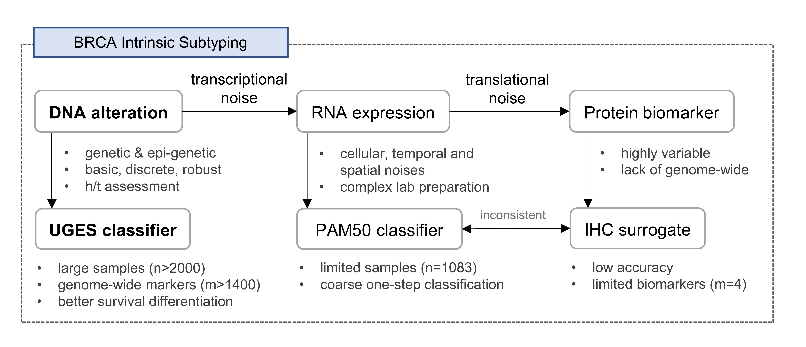

# UGES, a DNA-level predictive model for breast cancer intrinsic subtyping

## Introduction

This repository is code dedicated to the testing data of UGES, a classifier which have good performance in identifying the intrinsic subtypes of breast cancer. Leveraging two large-scale (The Cancer Genome Atlas, or TCGA and METABRIC cohorts, total n=2065), multi-omics (mutation, CNA, methylation and expression) datasets, we developed a DNA-level predictive model, which we termed UGES (Unified Genetic and Epigenetic Subtyping for breast cancer) using hierarchical stepwise learning method.

The required dependency is R.

The code is contained in <code.md>; the data details are shown in <The_data_for_UGES.md>.

Figure 1: Conceptual design of this study

***
# Contact & Support:

- Li C. Xia: email: lcxia@scut.edu.cn

- Jiemin Xie: email: 202120130808@mail.scut.edu.cn
