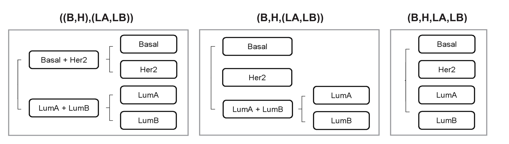
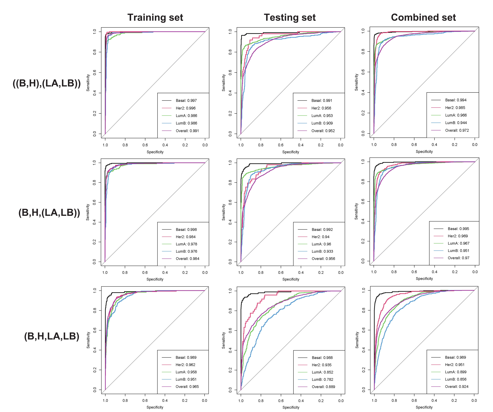
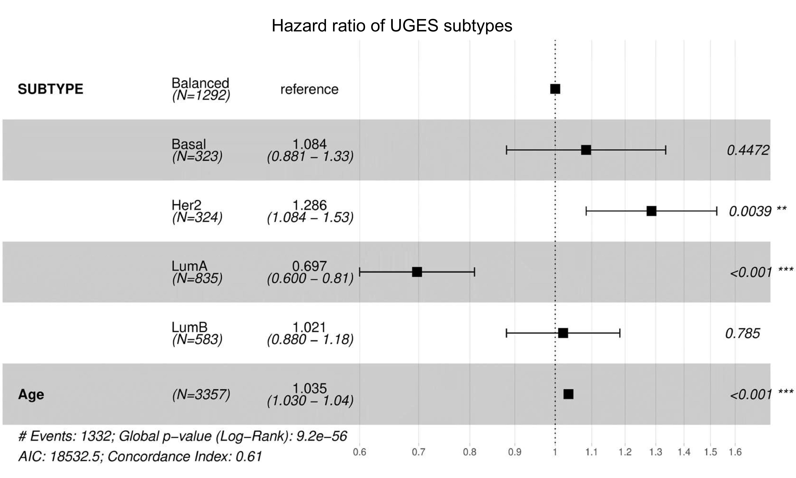

# UGES breast cancer intrinsic subtype classifier

Here, we complete the UGES pipeline on a small sample dataset. Our starting point is based on pre-processed genomics/epigenomics/expression/clinical data that have been segmented by sample. We demonstrate how the data can be imported into R software for analysis.

## Getting ready

First we load the packages.

```{R}
library(glmnet)
library(pROC)
library(dplyr)
library(survival)
library(survminer)
library(ggplot2)
```

Then we import the example data, and divide it into four parts that denote combined data and three single-feature data, repectively.

```{R}
data <- read.csv("~/R/Breastcancer/newdata/cna_gene_methylation.csv")       # original combined data
standard <- read.csv("~/R/Breastcancer/newdata/standard_cna_mu_me.csv")     # standardize combined data
mutation <- data[,2:16772]
cna <- data[,c(2,16773:42366)]
methylation <- data[,c(2,42367:50833)]
```

## Lasso-Logistic regression

We evaluate three competitive hierarchical stepwise classification strategies: (B,H,LA,LB), (B,H,(LA,LB)) and ((B,H),(LA,LB)). Among these strategies, we use Lasso-Logistic regression method to construct different classifiers and compared their performance. In our dataset, there are **2065 samples** in total.



<center>Figure 1: Three competitive hierarchical stepwise classification strategies.</center>

### (B,H,LA,LB) strategy

```{R}
s1 <- which(data$SUBTYPE == "1")
s2 <- which(data$SUBTYPE == "2")
s3 <- which(data$SUBTYPE == "3")
s4 <- which(data$SUBTYPE == "4")

# Lasso-Logistic regression
lasso_four <- function(x){        
  train_data <- x[train,]
  test_data <- x[test,]
  x.train <- as.matrix(sapply(data.frame(train_data[,c(2:ncol(train_data))]),as.numeric))
  y.train <- as.matrix(sapply(data.frame(train_data[,1]),as.numeric))
  x.test <- as.matrix(sapply(data.frame(test_data[,c(2:ncol(test_data))]),as.numeric))
  y.test <- as.matrix(sapply(data.frame(test_data[,1]),as.numeric))
  
  #glmnet()
  fit <- glmnet(x.train, y.train, family="multinomial", alpha=1)
  
  #cv.glmnet()
  set.seed(1)
  cv.fit <- cv.glmnet(x.train, y.train, family="multinomial", alpha=1, 
                      type.measure = "class", nfolds = 10)
  bestlam <- cv.fit$lambda.min
  
  #training result
  train_pred <- predict(fit, s = bestlam, newx = x.train, type="class")
  train_pred_prob <- predict(cv.fit, newx=x.train , s=bestlam, type="response")
  train_t <- table(y.train, train_pred, dnn=c("True","Prediction"))
  train_acc <- rep(0,4)
  if (dim(train_t)[2] == 4){
    for (i in 1:4) {
      train_acc[i] <- train_t[i,i]/sum(train_t[i,])
    }
  } else{
    for (i in 1:3) {
      train_acc[i] <- train_t[i,i]/sum(train_t[i,])
    }
  }
  train_auc <- auc(multiclass.roc(train_data$SUBTYPE,as.numeric(train_pred)))
  
  #testing result
  test_pred <- predict(fit, s = bestlam, newx = x.test, type="class")
  test_pred_prob <- predict(cv.fit, newx=x.test , s=bestlam, type="response")
  test_t <- table(y.test, test_pred, dnn=c("True","Prediction"))
  test_acc <- rep(0,4)
  if (dim(test_t)[2] == 4){
    for (i in 1:4) {
      test_acc[i] <- test_t[i,i]/sum(test_t[i,])
    }
  } else{
    for (i in 1:3) {
      test_acc[i] <- test_t[i,i]/sum(test_t[i,])
    }
  }
  test_auc <- auc(multiclass.roc(test_data$SUBTYPE,as.numeric(test_pred)))
  
  result <- list(fit = fit, bestlam = bestlam, train_pred = train_pred, 
                 train_pred_prob = train_pred_prob, train_t = train_t, 
                 train_acc =train_acc, train_auc = train_auc, 
                 test_pred = test_pred, test_pred_prob = test_pred_prob,
                 test_t = test_t, test_acc = test_acc, test_auc = test_auc)
  return(result)
}

# divide the training and testing sets, ensuring sample balance
set.seed(900)
train <- c(sample(s1,200),sample(s2,200),sample(s3,200),sample(s4,200))   #sample balance
test <- c(1:nrow(data))[-train]

# generate ROC curves of the (B,H,LA,LB) strategy
IV_OVR_train <- function(x){
  train_data <- x[train,]
  test_data <- x[test,]
  IV <- lasso_four(x)
  IV$train_pred_prob <- as.matrix(data.frame(IV$train_pred_prob))
  colnames(IV$train_pred_prob) <- c(1,2,3,4)
  IV$train_label <- matrix(0,dim(train_data)[1],4)
  IV$train_label[,1:4] <- train_data$SUBTYPE
  IV$train_label[,1][which(IV$train_label[,1] != 1)] <- 0
  IV$train_label[,2][which(IV$train_label[,2] != 2)] <- 0
  IV$train_label[,2][which(IV$train_label[,2] == 2)] <- 1
  IV$train_label[,3][which(IV$train_label[,3] != 3)] <- 0
  IV$train_label[,3][which(IV$train_label[,3] == 3)] <- 1
  IV$train_label[,4][which(IV$train_label[,4] != 4)] <- 0
  IV$train_label[,4][which(IV$train_label[,4] == 4)] <- 1
  
  train_roc1 <- roc(IV$train_label[,1], IV$train_pred_prob[,1], direction = "<", )
  train_roc2 <- roc(IV$train_label[,2], IV$train_pred_prob[,2], direction = "<")
  train_roc3 <- roc(IV$train_label[,3], IV$train_pred_prob[,3], direction = "<")
  train_roc4 <- roc(IV$train_label[,4], IV$train_pred_prob[,4], direction = "<")
  train_roc <- train_roc1
  train_roc$sensitivities <- (train_roc1$sensitivities + train_roc2$sensitivities + train_roc3$sensitivities + train_roc4$sensitivities)/4
  train_roc$specificities <- (train_roc1$specificities + train_roc2$specificities + train_roc3$specificities + train_roc4$specificities)/4
  train_roc$auc <- (train_roc1$auc + train_roc2$auc + train_roc3$auc + train_roc4$auc)/4
  roc <- plot(train_roc1,col='1')          #select 0 as control, 1 as case
  plot(train_roc2,col='2',add = TRUE)
  plot(train_roc3,col='3',add = TRUE)
  plot(train_roc4,col='4',add = TRUE)
  plot(train_roc,col='6',add = TRUE)
  legend('bottomright',
         legend = c(paste("Basal: ", round(auc(train_roc1),3), sep =""), 
                    paste("Her2: ", round(auc(train_roc2),3), sep =""), 
                    paste("LumA: ", round(auc(train_roc3),3), sep =""), 
                    paste("LumB: ", round(auc(train_roc4),3), sep =""),
                    paste("Overall: ", round(train_roc$auc,3), sep ="")),
         col = c("1", "2", "3", "4","6"), lty = 1)
  
  return(roc)
}

IV_OVR_test <- function(x){
  train_data <- x[train,]
  test_data <- x[test,]
  IV <- lasso_four(x)
  IV$test_pred_prob <- as.matrix(data.frame(IV$test_pred_prob))
  colnames(IV$test_pred_prob) <- c(1,2,3,4)
  IV$test_label <- matrix(0,dim(test_data)[1],4)
  IV$test_label[,1:4] <- test_data$SUBTYPE
  IV$test_label[,1][which(IV$test_label[,1] != 1)] <- 0
  IV$test_label[,2][which(IV$test_label[,2] != 2)] <- 0
  IV$test_label[,2][which(IV$test_label[,2] == 2)] <- 1
  IV$test_label[,3][which(IV$test_label[,3] != 3)] <- 0
  IV$test_label[,3][which(IV$test_label[,3] == 3)] <- 1
  IV$test_label[,4][which(IV$test_label[,4] != 4)] <- 0
  IV$test_label[,4][which(IV$test_label[,4] == 4)] <- 1
  
  test_roc1 <- roc(IV$test_label[,1], IV$test_pred_prob[,1], direction = "<", )
  test_roc2 <- roc(IV$test_label[,2], IV$test_pred_prob[,2], direction = "<")
  test_roc3 <- roc(IV$test_label[,3], IV$test_pred_prob[,3], direction = "<")
  test_roc4 <- roc(IV$test_label[,4], IV$test_pred_prob[,4], direction = "<")
  test_roc <- test_roc1
  test_roc$sensitivities <- (test_roc1$sensitivities + test_roc2$sensitivities + test_roc3$sensitivities + test_roc4$sensitivities)/4
  test_roc$specificities <- (test_roc1$specificities + test_roc2$specificities + test_roc3$specificities + test_roc4$specificities)/4
  test_roc$auc <- (test_roc1$auc + test_roc2$auc + test_roc3$auc + test_roc4$auc)/4
  roc <- plot(test_roc1,col='1')          #select 0 as control, 1 as case
  plot(test_roc2,col='2',add = TRUE)
  plot(test_roc3,col='3',add = TRUE)
  plot(test_roc4,col='4',add = TRUE)
  plot(test_roc,col='6',add = TRUE)
  legend('bottomright',
         legend = c(paste("Basal: ", round(auc(test_roc1),3), sep =""), 
                    paste("Her2: ", round(auc(test_roc2),3), sep =""), 
                    paste("LumA: ", round(auc(test_roc3),3), sep =""), 
                    paste("LumB: ", round(auc(test_roc4),3), sep =""),
                    paste("Overall: ", round(test_roc$auc,3), sep ="")),
         col = c("1", "2", "3", "4","6"), lty = 1)
  
  return(roc)
}

# plot the ROC curves of the training and testing sets on different features of the (B,H,LA,LB) strategy
par(mfrow = c(2,4))
IV_OVR_train(mutation)
IV_OVR_train(cna)
IV_OVR_train(methylation)
IV_OVR_train(standard[,-1])
IV_OVR_test(mutation)
IV_OVR_test(cna)
IV_OVR_test(methylation)
IV_OVR_test(standard[,-1])

IV_OVR <- function(x){
  train_data <- x[train,]
  test_data <- x[test,]
  IV <- lasso_four(x)
  
  data <- rbind(train_data,test_data)
  IV$pred_prob <- as.matrix(rbind(data.frame(IV$train_pred_prob),data.frame(IV$test_pred_prob)))
  colnames(IV$pred_prob) <- c(1,2,3,4)
  IV$label <- matrix(0,dim(data)[1],4)
  IV$label[,1:4] <- data$SUBTYPE
  IV$label[,1][which(IV$label[,1] != 1)] <- 0
  IV$label[,2][which(IV$label[,2] != 2)] <- 0
  IV$label[,2][which(IV$label[,2] == 2)] <- 1
  IV$label[,3][which(IV$label[,3] != 3)] <- 0
  IV$label[,3][which(IV$label[,3] == 3)] <- 1
  IV$label[,4][which(IV$label[,4] != 4)] <- 0
  IV$label[,4][which(IV$label[,4] == 4)] <- 1
  
  roc1 <- roc(IV$label[,1], IV$pred_prob[,1], direction = "<")
  roc2 <- roc(IV$label[,2], IV$pred_prob[,2], direction = "<")
  roc3 <- roc(IV$label[,3], IV$pred_prob[,3], direction = "<")
  roc4 <- roc(IV$label[,4], IV$pred_prob[,4], direction = "<")
  averroc <- roc1
  averroc$sensitivities <- (roc1$sensitivities + roc2$sensitivities + roc3$sensitivities + roc4$sensitivities)/4
  averroc$specificities <- (roc1$specificities + roc2$specificities + roc3$specificities + roc4$specificities)/4
  averroc$auc <- (roc1$auc + roc2$auc + roc3$auc + roc4$auc)/4
  roc <- plot(roc1,col='1')          #select 0 as control, 1 as case
  plot(roc2,col='2',add = TRUE)
  plot(roc3,col='3',add = TRUE)
  plot(roc4,col='4',add = TRUE)
  plot(averroc,col='6',add = TRUE)
  legend('bottomright',
         legend = c(paste("Basal: ", round(auc(roc1),3), sep =""), 
                    paste("Her2: ", round(auc(roc2),3), sep =""), 
                    paste("LumA: ", round(auc(roc3),3), sep =""), 
                    paste("LumB: ", round(auc(roc4),3), sep =""),
                    paste("Overall: ", round(averroc$auc,3), sep ="")),
         col = c("1", "2", "3", "4","6"), lty = 1)
  
  return(roc)
}

# plot the ROC curves of the mutation, CNA, methylation and combined data of the (B,H,LA,LB) strategy
par(mfrow = c(2,4))
IV_OVR(mutation)
IV_OVR(cna)
IV_OVR(methylation)
IV_OVR(standard[,-1])
```

### (B,H,(LA,LB)) strategy

```{R}
# the first step
data1 <- standard[,-1]
data1[,1][which(data1[,1] == '4')]<- as.numeric(3)

lasso_three <- function(x){
  train_data <- x[train,]
  test_data <- x[test,]
  x.train <- as.matrix(sapply(data.frame(train_data[,c(2:ncol(train_data))]),as.numeric))
  y.train <- as.matrix(sapply(data.frame(train_data[,1]),as.numeric))
  x.test <- as.matrix(sapply(data.frame(test_data[,c(2:ncol(test_data))]),as.numeric))
  y.test <- as.matrix(sapply(data.frame(test_data[,1]),as.numeric))
  
  #glmnet()
  fit <- glmnet(x.train, y.train, family="multinomial", alpha=1)
  
  #cv.glmnet()
  set.seed(1)
  cv.fit <- cv.glmnet(x.train, y.train, family="multinomial", alpha=1, 
                      type.measure = "class", nfolds = 10)
  bestlam <- cv.fit$lambda.min
  secondlam <- cv.fit$lambda.1se
  
  #training result
  train_pred <- predict(fit, s = bestlam, newx = x.train, type="class")
  train_pred_prob <- predict(cv.fit, s = bestlam, newx = x.train, type="response")
  train_auc <- auc(multiclass.roc(train_data$SUBTYPE,as.numeric(train_pred)))
  
  #testing result
  test_pred <- predict(fit, s = bestlam, newx = x.test, type="class")
  test_pred_prob <- predict(cv.fit, s = bestlam, newx = x.test, type="response")
  test_auc <- auc(multiclass.roc(test_data$SUBTYPE,as.numeric(test_pred)))
  
  bestmodel <- glmnet(x.train, y.train, alpha=1, lambda = bestlam)
  coef <- coef(bestmodel)
  coef <- as.data.frame(coef[,1])
  coef <- cbind(rownames(coef),coef[,1])
  coef <- as.data.frame(coef[-which(coef[,2] == 0),])
  
  result <- list(fit = fit, bestlam = bestlam, secondlam = secondlam,
                 train_pred = train_pred, train_pred_prob = train_pred_prob, 
                 train_auc = train_auc, test_pred = test_pred,
                 test_pred_prob = test_pred_prob, test_auc = test_auc, coef = coef)
  return(result)
}

# select the same training and testing sets
set.seed(900)
train <- c(sample(s1,200),sample(s2,200),sample(s3,200),sample(s4,200))   #sample balance
test <- c(1:nrow(data))[-train]

# compute the preditive probibility of three types in the first step
III_pro <- function(x){
  data3 <- x
  data3[,1][which(data3[,1] == '4')]<- as.numeric(3)
  train_data <- data3[train,]
  test_data <- data3[test,]
  III <- lasso_three(data3)
  
  pred_prob <- as.matrix(rbind(data.frame(III$train_pred_prob),data.frame(III$test_pred_prob)))
  colnames(pred_prob) <- c(1,2,3)
  rownames(pred_prob) <- c(train,test)
  return(pred_prob)
}

mu_III_II_pro1 <- III_pro(mutation)
cna_III_II_pro1 <- III_pro(cna)
me_III_II_pro1 <- III_pro(methylation)
III_II_pro1 <- III_pro(standard[,-1])


# the second step
data2 <- standard[,-1]
data2 <- subset(data2, SUBTYPE=="3" | SUBTYPE=="4")

s8 <- which(data2$SUBTYPE == "3")
s9 <- which(data2$SUBTYPE == "4")

# In the second step, the test data we use should be the sample data predicted as LumA and LumB in the first step.
# select the same training and testing sets
set.seed(900)
train <- c(sample(s1,200),sample(s2,200),sample(s3,200),sample(s4,200))   #sample balance
test <- c(1:nrow(data))[-train]

# generate the new test data on the basis of the first step
newtest <- function(x){
  data <- x
  data[,1][which(data[,1] == '4')]<- as.numeric(3)
  train_data <- data[train,]
  test_data <- data[test,]
  III <- lasso_three(data)
  newtest <- rbind(train_data[which((III$train_pred)[,1] == 3),], test_data[which((III$test_pred) == 3),])
  newtest_data <- x[rownames(newtest),]
  return(newtest_data)
}
#test_data <- newtest(mutation)
#test_data <- newtest(cna)
#test_data <- newtest(methylation)
test_data <- newtest(standard[,-1])

lasso_two <- function(x){
  train_data <- x[train,]
  x.train <- as.matrix(sapply(data.frame(train_data[,c(2:ncol(train_data))]),as.numeric))
  y.train <- as.matrix(sapply(data.frame(train_data[,1]),as.numeric))
  x.test <- as.matrix(sapply(data.frame(test_data[,c(2:ncol(test_data))]),as.numeric))
  y.test <- as.matrix(sapply(data.frame(test_data[,1]),as.numeric))
  
  #glmnet()
  fit <- glmnet(x.train, y.train, family="binomial", alpha=1)
  
  #cv.glmnet()
  set.seed(1)
  cv.fit <- cv.glmnet(x.train, y.train, family="binomial", alpha=1, 
                      type.measure = "class", nfolds = 10)
  bestlam <- cv.fit$lambda.min
  secondlam <- cv.fit$lambda.1se
  
  #training result
  train_pred <- predict(fit, s = bestlam, newx = x.train, type="class")
  train_pred_prob <- predict(cv.fit, s = bestlam, newx = x.train, type="response")
  train_auc <- auc(multiclass.roc(train_data$SUBTYPE,as.numeric(train_pred)))
  
  #testing result
  test_pred <- predict(fit, s = bestlam, newx = x.test, type="class")
  test_pred_prob <- predict(cv.fit, s = bestlam, newx = x.test, type="response")
  test_auc <- auc(multiclass.roc(test_data$SUBTYPE,as.numeric(test_pred)))
  
  bestmodel <- glmnet(x.train, y.train, alpha=1, lambda = bestlam)
  coef <- coef(bestmodel)
  coef <- as.data.frame(coef[,1])
  coef <- cbind(rownames(coef),coef[,1])
  coef <- as.data.frame(coef[-which(coef[,2] == 0),])
  
  result <- list(fit = fit, bestlam = bestlam, secondlam = secondlam,
                 train_pred = train_pred, train_pred_prob = train_pred_prob, 
                 train_auc = train_auc, test_pred = test_pred,
                 test_pred_prob = test_pred_prob, test_auc = test_auc, coef = coef)
  return(result)
}

# divide the training and testing sets in the (LA,LB) classification problem
set.seed(1000)
train <- c(sample(s8,500),sample(s9,500))
train_data <- data2[train,]

#test_data <- mutation[rownames(mu_III_II_pro1),]
#test_data <- cna[rownames(cna_III_II_pro1),]
#test_data <- methylation[rownames(me_III_II_pro1),]
test_data <- standard[rownames(III_II_pro1),-1]

# compute the preditive probibility of two types in the second step
II_pro <- function(x){
  data <- x
  data <- subset(data, SUBTYPE=="3" | SUBTYPE=="4")
  train_data <- data[train,]
  II <- lasso_two(data)
  
  pred_prob <- as.data.frame(II$test_pred_prob)
  pred_prob[,2] <- 1
  pred_prob[,2] <- pred_prob[,2]-pred_prob[,1]
  pred_prob <- as.matrix(pred_prob)
  colnames(pred_prob) <- c(4,3)
  return(pred_prob)
}
#mu_III_II_pro2 <- II_pro(mutation)
#cna_III_II_pro2 <- II_pro(cna)
#me_III_II_pro2 <- II_pro(methylation)
III_II_pro2 <- II_pro(standard[,-1])

# compute the overall probibility of the (B,H,(LA,LB)) strategy
mu_III_II_pro <- cbind(mu_III_II_pro1[,1:2], mu_III_II_pro1[,3]*mu_III_II_pro2[,2], mu_III_II_pro1[,3]*mu_III_II_pro2[,1])
colnames(mu_III_II_pro) <- 1:4
cna_III_II_pro <- cbind(cna_III_II_pro1[,1:2], cna_III_II_pro1[,3]*cna_III_II_pro2[,2], cna_III_II_pro1[,3]*cna_III_II_pro2[,1])
colnames(cna_III_II_pro) <- 1:4
me_III_II_pro <- cbind(me_III_II_pro1[,1:2], me_III_II_pro1[,3]*me_III_II_pro2[,2], me_III_II_pro1[,3]*me_III_II_pro2[,1])
colnames(me_III_II_pro) <- 1:4
III_II_pro <- cbind(III_II_pro1[,1:2], III_II_pro1[,3]*III_II_pro2[,2], III_II_pro1[,3]*III_II_pro2[,1])
colnames(III_II_pro) <- 1:4

# generate ROC curves of the (B,H,(LA,LB)) strategy
III_OVR <- function(x,y){
  label <- matrix(0,dim(x)[1],4)
  label[,1:4] <- x$SUBTYPE
  label[,1][which(label[,1] != 1)] <- 0
  label[,2][which(label[,2] != 2)] <- 0
  label[,2][which(label[,2] == 2)] <- 1
  label[,3][which(label[,3] != 3)] <- 0
  label[,3][which(label[,3] == 3)] <- 1
  label[,4][which(label[,4] != 4)] <- 0
  label[,4][which(label[,4] == 4)] <- 1
  
  roc1 <- roc(label[,1], y[,1], direction = "<")
  roc2 <- roc(label[,2], y[,2], direction = "<")
  roc3 <- roc(label[,3], y[,3], direction = "<")
  roc4 <- roc(label[,4], y[,4], direction = "<")
  averroc <- roc1
  averroc$sensitivities <- (roc1$sensitivities + roc2$sensitivities + roc3$sensitivities + roc4$sensitivities)/4
  averroc$specificities <- (roc1$specificities + roc2$specificities + roc3$specificities + roc4$specificities)/4
  averroc$auc <- (roc1$auc + roc2$auc + roc3$auc + roc4$auc)/4
  roc <- plot(roc1,col='1')          #select 0 as control, 1 as case
  plot(roc2,col='2',add = TRUE)
  plot(roc3,col='3',add = TRUE)
  plot(roc4,col='4',add = TRUE)
  plot(averroc,col='6',add = TRUE)
  legend('bottomright',
         legend = c(paste("Basal: ", round(auc(roc1),3), sep =""), 
                    paste("Her2: ", round(auc(roc2),3), sep =""), 
                    paste("LumA: ", round(auc(roc3),3), sep =""), 
                    paste("LumB: ", round(auc(roc4),3), sep =""),
                    paste("Overall: ", round(averroc$auc,3), sep ="")),
         col = c("1", "2", "3", "4","6"), lty = 1)
  
  return(roc)
}

# plot the ROC curves of the mutation, CNA, methylation and combined data of the (B,H,(LA,LB)) strategy
par(mfrow = c(2,4))
III_OVR(standard[rownames(mu_III_II_pro1),-1], mu_III_II_pro)
III_OVR(standard[rownames(cna_III_II_pro1),-1], cna_III_II_pro)
III_OVR(standard[rownames(me_III_II_pro1),-1], me_III_II_pro)
III_OVR(standard[rownames(III_II_pro1),-1], III_II_pro)

# plot the ROC curves of the training and testing sets on different features of the (B,H,(LA,LB)) strategy
set.seed(900)
train <- c(sample(s1,200),sample(s2,200),sample(s3,200),sample(s4,200))   #sample balance
test <- c(1:nrow(data))[-train]
par(mfrow = c(2,4))
III_OVR(standard[train,-1], mu_III_II_pro[1:800,])
III_OVR(standard[train,-1], cna_III_II_pro[1:800,])
III_OVR(standard[train,-1], me_III_II_pro[1:800,])
III_OVR(standard[train,-1], III_II_pro[1:800,])
III_OVR(standard[test,-1], mu_III_II_pro[801:2065,])
III_OVR(standard[test,-1], cna_III_II_pro[801:2065,])
III_OVR(standard[test,-1], me_III_II_pro[801:2065,])
III_OVR(standard[test,-1], III_II_pro[801:2065,])
```

### ((B,H),(LA,LB)) strategy

```{R}
# the first step
data3 <- standard[,-1]
data3[,1][which(data3[,1] == '2')]<- as.numeric(1)
data3[,1][which(data3[,1] == '3')]<- as.numeric(2)
data3[,1][which(data3[,1] == '4')]<- as.numeric(2)

# divide the training and testing sets as before
set.seed(900)
train <- c(sample(s1,200),sample(s2,200),sample(s3,200),sample(s4,200))   #sample balance
test <- c(1:nrow(data))[-train]
train_data <- data3[train,]
test_data <- data3[test,]

# In the second step, the test data we use should be the sample data predicted as (B,H) or (LA,LB) in the first step.
# generate the new test data on the basis of the first step
newtest2 <- function(x){
  data <- x
  data[,1][which(data[,1] == '2')]<- as.numeric(1)
  data[,1][which(data[,1] == '3')]<- as.numeric(2)
  data[,1][which(data[,1] == '4')]<- as.numeric(2)
  
  II <- lasso_two(data)
  bhtest <- rbind(train_data[which((II$train_pred)[,1] == 1),], test_data[which((II$test_pred) == 1),])
  lltest <- rbind(train_data[which((II$train_pred)[,1] == 2),], test_data[which((II$test_pred) == 2),])
  bhtest_data <- x[rownames(bhtest),]
  lltest_data <- x[rownames(lltest),]
  result <- list(bhtest_data = bhtest_data, lltest_data = lltest_data)
  return(result)
}

# bhtest denotes the test data predicted as (B,H) in the first step, and lltest denotes the test data predicted as (LA,LB) in the first step
mu_bhtest <- newtest2(mutation)$bhtest_data
mu_lltest <- newtest2(mutation)$lltest_data

cna_bhtest <- newtest2(cna)$bhtest_data
cna_lltest <- newtest2(cna)$lltest_data

me_bhtest <- newtest2(methylation)$bhtest_data
me_lltest <- newtest2(methylation)$lltest_data

bhtest <- newtest2(standard[,-1])$bhtest_data
lltest <- newtest2(standard[,-1])$lltest_data

# compute the preditive probibility of two types in the first step
bh_ll_pro <- function(x){
  data <- x
  data[,1][which(data[,1] == '2')]<- as.numeric(1)
  data[,1][which(data[,1] == '3')]<- as.numeric(2)
  data[,1][which(data[,1] == '4')]<- as.numeric(2)
  II <- lasso_two(data)
  
  pred_prob <- as.data.frame(rbind(data.frame(II$train_pred_prob),data.frame(II$test_pred_prob)))
  pred_prob[,2] <- 1
  pred_prob[,2] <- pred_prob[,2]-pred_prob[,1]
  pred_prob <- as.matrix(pred_prob)
  colnames(pred_prob) <- c(2,1)
  rownames(pred_prob) <- c(train,test)
  return(pred_prob)
}
mu_II_II_pro1 <- bh_ll_pro(mutation)
cna_II_II_pro1 <- bh_ll_pro(cna)
me_II_II_pro1 <- bh_ll_pro(methylation)
II_II_pro1 <- bh_ll_pro(standard[,-1])


# (B,H) classification in the second step
data4 <- standard[,-1]
data4 <- subset(data4, SUBTYPE=="1" | SUBTYPE=="2")

s12 <- which(data4$SUBTYPE == "1")
s13 <- which(data4$SUBTYPE == "2")

# divide the training and testing sets in the (B,H) classification problem
set.seed(1500)
train <- c(sample(s12,200),sample(s13,200))
train_data <- data4[train,]

#test_data <- mutation[rownames(mu_II_II_pro1),]
#test_data <- cna[rownames(cna_II_II_pro1),]
#test_data <- methylation[rownames(me_II_II_pro1),]
test_data <- standard[rownames(II_II_pro1),-1]

# compute the preditive probibility of Basal and Her2 subtypes in the second step
bh_pro <- function(x){
  data <- x
  data <- subset(data, SUBTYPE=="1" | SUBTYPE=="2")
  
  II <- lasso_two(data)
  
  pred_prob <- as.data.frame(II$test_pred_prob)
  pred_prob[,2] <- 1
  pred_prob[,2] <- pred_prob[,2]-pred_prob[,1]
  pred_prob <- as.matrix(pred_prob)
  colnames(pred_prob) <- c(2,1)
  return(pred_prob)
}
#mu_II_II_pro2 <- bh_pro(mutation)
#cna_II_II_pro2 <- bh_pro(cna)
#me_II_II_pro2 <- bh_pro(methylation)
II_II_pro2 <- bh_pro(standard[,-1])


# (LA,LB) classification in the second step
data2 <- standard[,-1]
data2 <- subset(data2, SUBTYPE=="3" | SUBTYPE=="4")

s8 <- which(data2$SUBTYPE == "3")
s9 <- which(data2$SUBTYPE == "4")

# divide the training and testing sets in the (LA,LB) classification problem as before
set.seed(1000)
train <- c(sample(s8,500),sample(s9,500))
train_data <- data2[train,]

#test_data <- mutation[rownames(mu_II_II_pro1),]
#test_data <- cna[rownames(cna_II_II_pro1),]
#test_data <- methylation[rownames(me_II_II_pro1),]
test_data <- standard[rownames(II_II_pro1),-1]

# compute the preditive probibility of LumA and LumB subtypes in the second step
ll_pro <- function(x){
  data <- x
  data <- subset(data, SUBTYPE=="3" | SUBTYPE=="4")
  
  II <- lasso_two(data)
  
  pred_prob <- as.data.frame(II$test_pred_prob)
  pred_prob[,2] <- 1
  pred_prob[,2] <- pred_prob[,2]-pred_prob[,1]
  pred_prob <- as.matrix(pred_prob)
  colnames(pred_prob) <- c(4,3)
  return(pred_prob)
}
#mu_II_II_pro3 <- ll_pro(mutation)
#cna_II_II_pro3 <- ll_pro(cna)
#me_II_II_pro3 <- ll_pro(methylation)
II_II_pro3 <- ll_pro(standard[,-1])

# compute the overall probibility of the ((B,H),(LA,LB)) strategy
mu_II_II_pro <- cbind(mu_II_II_pro1[,2]*mu_II_II_pro2[,2], mu_II_II_pro1[,2]*mu_II_II_pro2[,1], 
                      mu_II_II_pro1[,1]*mu_II_II_pro3[,2], mu_II_II_pro1[,1]*mu_II_II_pro3[,1])
colnames(mu_II_II_pro) <- 1:4
cna_II_II_pro <- cbind(cna_II_II_pro1[,2]*cna_II_II_pro2[,2], cna_II_II_pro1[,2]*cna_II_II_pro2[,1], 
                       cna_II_II_pro1[,1]*cna_II_II_pro3[,2], cna_II_II_pro1[,1]*cna_II_II_pro3[,1])
colnames(cna_II_II_pro) <- 1:4
me_II_II_pro <- cbind(me_II_II_pro1[,2]*me_II_II_pro2[,2], me_II_II_pro1[,2]*me_II_II_pro2[,1], 
                      me_II_II_pro1[,1]*me_II_II_pro3[,2], me_II_II_pro1[,1]*me_II_II_pro3[,1])
colnames(me_II_II_pro) <- 1:4
II_II_pro <- cbind(II_II_pro1[,2]*II_II_pro2[,2], II_II_pro1[,2]*II_II_pro2[,1], 
                   II_II_pro1[,1]*II_II_pro3[,2], II_II_pro1[,1]*II_II_pro3[,1])
colnames(II_II_pro) <- 1:4

# generate ROC curves of the (B,H,(LA,LB)) strategy
II_II_OVR <- function(x,y){
  label <- matrix(0,dim(x)[1],4)
  label[,1:4] <- x$SUBTYPE
  label[,1][which(label[,1] != 1)] <- 0
  label[,2][which(label[,2] != 2)] <- 0
  label[,2][which(label[,2] == 2)] <- 1
  label[,3][which(label[,3] != 3)] <- 0
  label[,3][which(label[,3] == 3)] <- 1
  label[,4][which(label[,4] != 4)] <- 0
  label[,4][which(label[,4] == 4)] <- 1
  
  roc1 <- roc(label[,1], y[,1], direction = "<")
  roc2 <- roc(label[,2], y[,2], direction = "<")
  roc3 <- roc(label[,3], y[,3], direction = "<")
  roc4 <- roc(label[,4], y[,4], direction = "<")
  averroc <- roc1
  averroc$sensitivities <- (roc1$sensitivities + roc2$sensitivities + roc3$sensitivities + roc4$sensitivities)/4
  averroc$specificities <- (roc1$specificities + roc2$specificities + roc3$specificities + roc4$specificities)/4
  averroc$auc <- (roc1$auc + roc2$auc + roc3$auc + roc4$auc)/4
  roc <- plot(roc1,col='1')          #select 0 as control, 1 as case
  plot(roc2,col='2',add = TRUE)
  plot(roc3,col='3',add = TRUE)
  plot(roc4,col='4',add = TRUE)
  plot(averroc,col='6',add = TRUE)
  legend('bottomright',
         legend = c(paste("Basal: ", round(auc(roc1),3), sep =""), 
                    paste("Her2: ", round(auc(roc2),3), sep =""), 
                    paste("LumA: ", round(auc(roc3),3), sep =""), 
                    paste("LumB: ", round(auc(roc4),3), sep =""),
                    paste("Overall: ", round(averroc$auc,3), sep ="")),
         col = c("1", "2", "3", "4","6"), lty = 1)
  
  return(roc)
}

# plot the ROC curves of the mutation, CNA, methylation and combined data of the ((B,H),(LA,LB)) strategy
par(mfrow = c(2,4))
II_II_OVR(mutation[rownames(mu_II_II_pro1),],mu_II_II_pro)
II_II_OVR(cna[rownames(cna_II_II_pro1),],cna_II_II_pro)
II_II_OVR(methylation[rownames(me_II_II_pro1),],me_II_II_pro)
II_II_OVR(standard[rownames(II_II_pro1),-1],II_II_pro)

# plot the ROC curves of the training and testing sets on different features of the ((B,H),(LA,LB)) strategy
par(mfrow = c(2,4))
II_II_OVR(mutation[train,],mu_II_II_pro[1:800,])
II_II_OVR(cna[train,],cna_II_II_pro[1:800,])
II_II_OVR(methylation[train,],me_II_II_pro[1:800,])
II_II_OVR(standard[train,-1],II_II_pro[1:800,])
II_II_OVR(mutation[test,],mu_II_II_pro[801:2065,])
II_II_OVR(cna[test,],cna_II_II_pro[801:2065,])
II_II_OVR(methylation[test,],me_II_II_pro[801:2065,])
II_II_OVR(standard[test,-1],II_II_pro[801:2065,])
```



<center>Figure 2: The performance of three strategies on the training, testing and combined sets, repectively.</center>


## Survival analysis

In order to explore the clinical relevance for UGES subtypes and compare that for PAM50 subtypes, we conduct survival analysis.

```{R}
# load the suvival data
survival <- read.csv("data/survival.csv")
UGES_survival <- read.csv("data/UGES_survival.csv")

# KM-plot
osfit1 <- survfit(Surv(OS_MONTHS, OS_STATUS) ~ SUBTYPE, data = survival)
osfit2 <- survfit(Surv(OS_MONTHS, OS_STATUS) ~ SUBTYPE, data = PADNA_survival)
suros1 <- ggsurvplot(osfit1,
                    pval = T,
                    conf.int=T,
                    pval.method = T,
                    
                    surv.median.line = 'hv',
                    
                    legend=c(0.9,0.85),
                    
                    legend.title='Original SUBTYPE',
                    legend.labs=c('Basal','Her2','LumA','LumB'),
                    
                    xlab='Time(Months)',
                    ylab='Survival probability',
                    
                    risk.table = TRUE)
suros2 <- ggsurvplot(osfit2,
                    pval = T,
                    conf.int=T,
                    pval.method = T,
                    
                    surv.median.line = 'hv',
                    
                    legend=c(0.9,0.85),
                    
                    legend.title='Original SUBTYPE',
                    legend.labs=c('Basal','Her2','LumA','LumB'),
                    
                    xlab='Time(Months)',
                    ylab='Survival probability',
                    
                    risk.table = TRUE)
suros1
suros2

# pairwise comparison
pairwise_survdiff(Surv(OS_MONTHS, OS_STATUS) ~ SUBTYPE, data = survival)
pairwise_survdiff(Surv(OS_MONTHS, OS_STATUS) ~ SUBTYPE, data = UGES_survival)
```


<center>Figure 3: The pairwise comparison in the univariate survival analysis.</center>

```{R}
# redefine the subtypes as characters
survival[which(survival[,2] == 1),2] <- 'Basal'
survival[which(survival[,2] == 2),2] <- 'Her2'
survival[which(survival[,2] == 3),2] <- 'LumA'
survival[which(survival[,2] == 4),2] <- 'LumB'
UGES_survival[which(PADNA_survival[,2] == 1),2] <- 'Basal'
UGES_survival[which(PADNA_survival[,2] == 2),2] <- 'Her2'
UGES_survival[which(PADNA_survival[,2] == 3),2] <- 'LumA'
UGES_survival[which(PADNA_survival[,2] == 4),2] <- 'LumB'

set.seed(1)
ref <- c(sample(s1,249),sample(s2,249),sample(s3,249),sample(s4,249))    # balance the samples
coxsurvival <- survival[ref,]
coxsurvival[,2] <- 'Balance'
coxsurvival <- rbind(coxsurvival,survival)
coxsurvival[,2] <- as.factor(coxsurvival[,2])

t1 <- which(UGES_survival[,2] == 'Basal')
t2 <- which(UGES_survival[,2] == 'Her2')
t3 <- which(UGES_survival[,2] == 'LumA')
t4 <- which(UGES_survival[,2] == 'LumB')
set.seed(1)
ref <- c(sample(t1,323),sample(t2,323),sample(t3,323),sample(t4,323))
coxUGES_survival <- PADNA_survival[ref,]
coxUGES_survival[,2] <- 'Balanced'
coxUGES_survival <- rbind(coxUGES_survival,UGES_survival)
coxUGES_survival[,2] <- as.factor(coxUGES_survival[,2])

survival[,2] <- as.factor(survival[,2])
UGES_survival[,2] <- as.factor(UGES_survival[,2])

# cox regression
cox1 <- coxph(Surv(OS_MONTHS, OS_STATUS) ~ SUBTYPE + Age, data = coxsurvival)
cox2 <- coxph(Surv(OS_MONTHS, OS_STATUS) ~ SUBTYPE + Age, data = coxUGES_survival)

# generate forest plot
ggforest(cox1, main="PAM50 subtypes - hazard ratio",
         cpositions=c(0.02,0.22,0.4),
         fontsize=1.2,refLabel="reference",noDigits=3)
ggforest(cox2, main="Hazard ratio",
         cpositions=c(0.02,0.22,0.4),
         fontsize=1.2,refLabel="reference",noDigits=3)
```



<center>Figure 4: The forest plot of UGES in the multivariate survival analysis.</center>

## Difference test

We performed different tests to identify the signature subtype-delineating alterations.

```{R}
# After outputing the coefficients of three sub-classifiers
list <- c(coeff1[2:61,1],coeff2[2:36,1],coeff3[2:54,1])     #top 10% in each sub-classifier
list <- as.data.frame(unlist(list %>% strsplit("_", fixed= T)))
mulist <- list[which(list[,1] == "gene")+1,]
cnalist <- list[which(list[,1] == "cna")+1,]
melist <- list[which(list[,1] == "me")+1,]
mulist <- unique(mulist)
cnalist <- unique(cnalist)
melist <- unique(melist)

# order by subtype
ID <- subtype[,c(1,2)]               # Here, subtype dataframe contains the patient ID and their correesponding UGES subtypes
ID[,2] <- as.character(ID[,2])
ID[which(ID[,2] == 'Basal'),2] <- 1
ID[which(ID[,2] == 'Her2'),2] <- 2
ID[which(ID[,2] == 'LumA'),2] <- 3
ID[which(ID[,2] == 'LumB'),2] <- 4
ID <- (ID[order(ID[,2]),])
ID <-ID[,1]

# mutation chi-square test
mutation_heatmap <- cbind(data[,1],mutation)
mutation_heatmap[,2] <- as.factor(subtype[,2])
mutation_heatmap <- (mutation_heatmap[order(mutation_heatmap[,2]),])[,-1:-2] %>% t()   # the same order
rownames(mutation_heatmap) <- substring(rownames(mutation_heatmap),6,100)              # retain the gene name only
mutation_heatmap <- mutation_heatmap[which(rownames(mutation_heatmap) %in% mulist),]   # intersect
row <- rownames(mutation_heatmap)
mutation_heatmap <- as.data.frame(mutation_heatmap)
mutation_heatmap <- as.data.frame(lapply(mutation_heatmap,as.numeric))
rownames(mutation_heatmap) <- row
mutation_heatmap <- as.matrix(mutation_heatmap)
colnames(mutation_heatmap) <- ID

mu_marker <- NULL           # restore the marker of mutation data
for(i in 1:length(rownames(mutation_heatmap))){
  weight <- c(length(which(mutation_heatmap[i,1:323] == 0)),length(which(mutation_heatmap[i,1:323] == 1)),
              length(which(mutation_heatmap[i,324:647] == 0)),length(which(mutation_heatmap[i,324:647] == 1)),
              length(which(mutation_heatmap[i,648:1482] == 0)),length(which(mutation_heatmap[i,648:1482] == 1)),
              length(which(mutation_heatmap[i,1483:2065] == 0)),length(which(mutation_heatmap[i,1483:2065] == 1)))
  data1 <- matrix(weight, nr = 2, nc = 4, dimnames = list(c("No","Yes"), c("Basal","Her2","LumA","LumB")))
  if (min(data1) < 5){
    if (fisher.test(data1)$p.value <0.01)
      mu_marker <- rbind(mu_marker,rownames(mutation_heatmap)[i])
  }
  else if (chisq.test(data1)$p.value <0.01)
    mu_marker <- rbind(mu_marker,rownames(mutation_heatmap)[i])
}

# CNA - Kruskal-Wallis H test
cna_heatmap <- cbind(data[,1],cna)
cna_heatmap[,2] <- subtype[,2]
cna_heatmap <- (cna_heatmap[order(cna_heatmap[,2]),])[,-1:-2] %>% t()        # the same order
rownames(cna_heatmap) <- substring(rownames(cna_heatmap),5,100)              # retain the gene name only
cna_heatmap <- cna_heatmap[which(rownames(cna_heatmap) %in% cnalist),]       # intersect
row <- rownames(cna_heatmap)
cna_heatmap <- as.data.frame(cna_heatmap)
cna_heatmap <- as.data.frame(lapply(cna_heatmap,as.numeric))
rownames(cna_heatmap) <- row
cna_heatmap <- as.matrix(cna_heatmap)
colnames(cna_heatmap) <- ID

library(coin)
Type=c(rep("Basal",323),rep("Her2",324),rep("LumA",835),rep("LumB",583))

cna_marker <- NULL            # restore the marker of CNA data
for(i in 1:length(rownames(cna_heatmap))){
  weight <- cna_heatmap[i,]
  if (kruskal.test(weight, Type)$p.value < 0.01)
    cna_marker <- rbind(cna_marker,rownames(cna_heatmap)[i])
}

# methylation - Welch ANOVA
methylation_scale <- methylation[,-1]
methylation_scale <- scale(rbind(scale(methylation_scale[1:931,]),scale(methylation_scale[932:2065,])))  # standardize
methylation_scale <- cbind(methylation[,1],methylation_scale)
methylation_heatmap <- cbind(data[,1],methylation_scale)
methylation_heatmap[,2] <- subtype[,2]
methylation_heatmap <- (methylation_heatmap[order(methylation_heatmap[,2]),])[,-1:-2] %>% t()       # the same order
rownames(methylation_heatmap) <- substring(rownames(methylation_heatmap),4,100)                     # retain the gene name only
methylation_heatmap <- methylation_heatmap[which(rownames(methylation_heatmap) %in% melist),]       # intersect
row <- rownames(methylation_heatmap)
methylation_heatmap <- as.data.frame(methylation_heatmap)
methylation_heatmap <- as.data.frame(lapply(methylation_heatmap,as.numeric))
rownames(methylation_heatmap) <- row
methylation_heatmap <- as.matrix(methylation_heatmap)
colnames(methylation_heatmap) <- ID

Type=c(rep("Basal",323),rep("Her2",324),rep("LumA",835),rep("LumB",583))
me_marker <- NULL            # restore the marker of methylation data
for(i in 1:length(rownames(methylation_heatmap))){
  weight <- methylation_heatmap[i,]
  data1 <- data.frame(Type,weight)
  data1$Type <- factor(data1$Type)
  if (oneway.test(weight ~ Type, data = data1, var.equal = FALSE)$p.value <0.01)
    me_marker <- rbind(me_marker,rownames(methylation_heatmap)[i])
}
```
